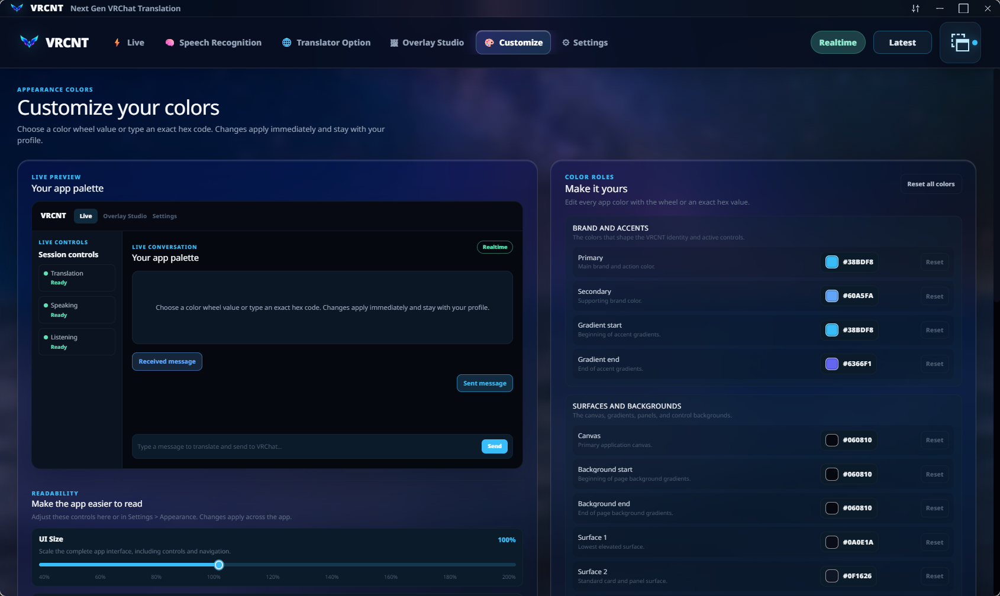
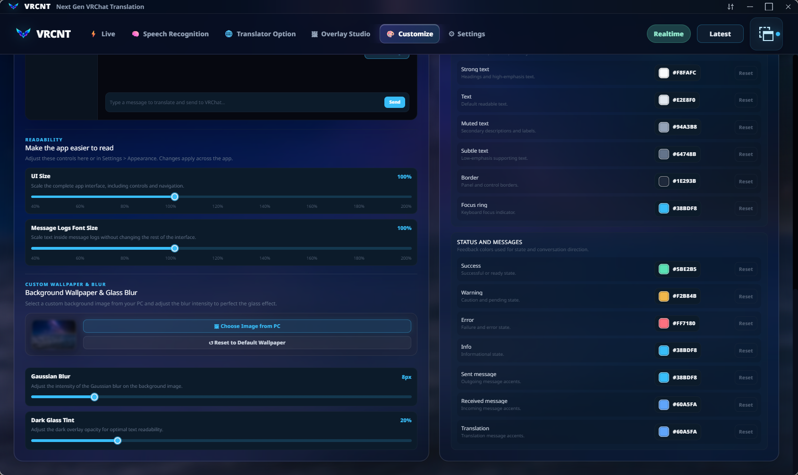
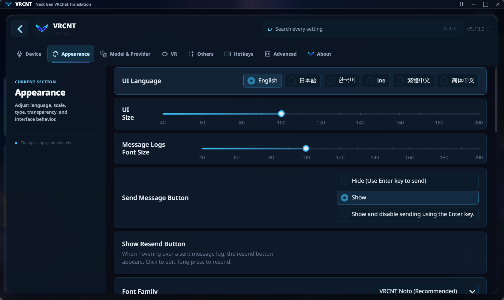

<p align="center">
  
</p>

<p align="center">
  <strong>Realtime translation and transcription for VRChat.</strong>
</p>

<p align="center">
  
  
  
</p>

<p align="center">
  <a data-virustotal-file="VRCNT.exe" href="https://www.virustotal.com/gui/file/d0fdb2ad78e3262500a0e0632b6d29001618ff7c92984f03a676756f40d2f1f8">
    
  </a>
  <a data-virustotal-file="VRCNT-backend.exe" href="https://www.virustotal.com/gui/file/4f0ab4b2daf84dfe59e95821bc548754639b517c88eb46f1a1c6202dc36fbb75">
    
  </a>
</p>

<p align="center">
  <font size="4">
    🌐 <strong>Select Language / เลือกภาษา</strong><br />
    <font color="#FFFFFF"><strong>English</strong></font> |
    <a href="Readme.th.md">ภาษาไทย</a> |
    <a href="Readme.jp.md">日本語</a> |
    <a href="Readme.scn.md">简体中文</a> |
    <a href="Readme.tcn.md">繁體中文</a> |
    <a href="Readme.kr.md">한국어</a>
  </font>
</p>

## About VRCNT

VRCNT is an unofficial VRChat translation and transcription app based on the
open-source [VRCT](https://github.com/misyaguziya/VRCT) project. It is designed
for conversations where latency matters: speech should become readable
translation quickly, without a slow cloud provider freezing the rest of the
session.

## VRCNT 5.13.0 preview

<p align="center">
  <font size="4"><strong>Live</strong></font>
</p>

<p align="center">
  
</p>

<p align="center">
  <font size="4"><strong>Speech Recognition</strong></font>
</p>

<p align="center">
  <font size="4"><strong>Engine selector</strong></font>
</p>

<p align="center">
  
</p>

<p align="center">
  <font size="4"><strong>Model selector</strong></font>
</p>

<p align="center">
  
</p>

<p align="center">
  <font size="4"><strong>Translator Option</strong></font>
</p>

<p align="center">
  
</p>

<p align="center">
  <font size="4"><strong>Overlay Studio</strong></font>
</p>

<p align="center">
  <font size="4"><strong>Desktop</strong></font>
</p>

<p align="center">
  
</p>

<p align="center">
  <font size="4"><strong>VR</strong></font>
</p>

<p align="center">
  
</p>

<p align="center">
  <font size="4"><strong>Customize</strong></font>
</p>

<p align="center">
  <font size="4"><strong>UI Color</strong></font>
</p>

<p align="center">
  
</p>

<p align="center">
  <font size="4"><strong>Background</strong></font>
</p>

<p align="center">
  
</p>

<p align="center">
  <font size="4"><strong>Settings (VRCT)</strong></font>
</p>

<p align="center">
  
</p>

## Translation quality and contributions

Translations for languages other than English are machine-generated. We are
planning improved Thai translation quality in the next build, and contributions
that improve any language are very welcome.

## Highlights

- Realtime microphone and speaker transcription.
- Multiple translation providers with automatic failover.
- A shared five-second cloud translation budget per sentence.
- Background provider cooldowns instead of blocking the live conversation.
- Optional local CTranslate2 fallback when cloud services are unavailable.
- Manual retry for an individual skipped or failed sentence.
- VR overlay, desktop overlay, clipboard, OSC, and VRChat chatbox output.
- One CUDA-enabled Windows build that can also use CPU processing.
- A focused matte-black and violet desktop interface.

## Hardware and performance

VRCNT works on CPU-only systems, but an NVIDIA GPU provides the best real-time performance.

VRCNT includes local AI runtime dependencies, which is why the application package is large. They let you use local speech and translation features without depending on a cloud service for every conversation.

- Speech models may require additional downloads after installation.
- Larger models require more RAM or VRAM, so choose a model that suits your computer.
- CPU-only mode is supported but may have higher latency, especially with larger speech models.
- Cloud engines can help weaker computers but require internet access.

## Build

Install dependencies:

```powershell
npm ci
```

Build the CUDA sidecar and Windows app:

```powershell
npm run build-cuda
```

The release executable and installer are generated under
`src-tauri/target/release`.

Official builds are published on [GitHub Releases](https://github.com/awakenginexe/VRCNT/releases).
The installer can download its three signed multipart package files, or use
`VRCNT_<version>.7z.001` through `.003` when they are placed beside it together
with `package-manifest.json` and `package-manifest.json.sig`. To run
VRCNT portably, keep all three parts together, extract `.7z.001` with 7-Zip,
and launch `VRCNT.exe` from the extracted directory.

Downloaded models and configuration are stored under
`%LOCALAPPDATA%\VRCNTData`. VRCNT 4.1.0 automatically migrates an existing
`VRCNT-NextData` directory when the new directory does not yet exist.

## Project lineage

VRCNT is based on [VRCT](https://github.com/misyaguziya/VRCT) by misyaguziya.
The original project and this fork are distributed under the MIT License.

Report VRCNT-specific problems through the
[VRCNT issue tracker](https://github.com/awakenginexe/VRCNT/issues),
not the upstream VRCT tracker.

## License and disclaimer

See [LICENSE](../LICENSE) and [NOTICE.md](../NOTICE.md). VRCNT is unofficial software;
it is not endorsed by VRChat. VRChat and its associated properties are
trademarks or registered trademarks of VRChat Inc.
