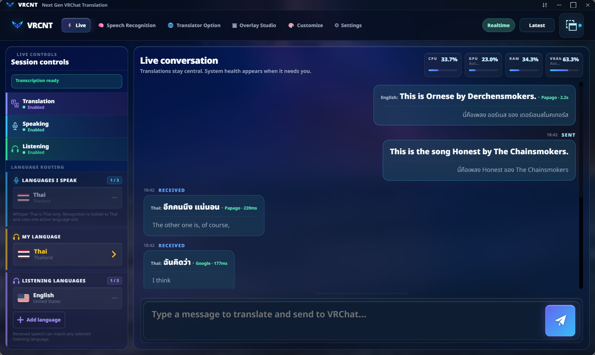
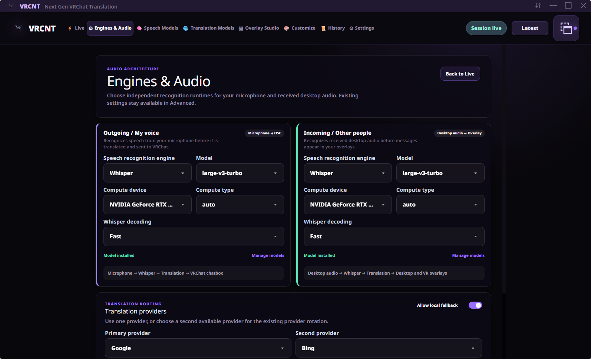
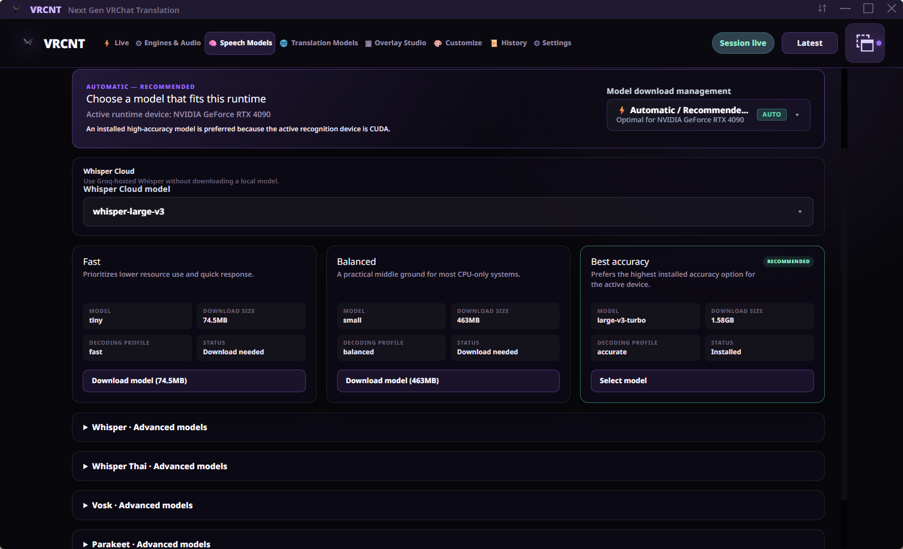
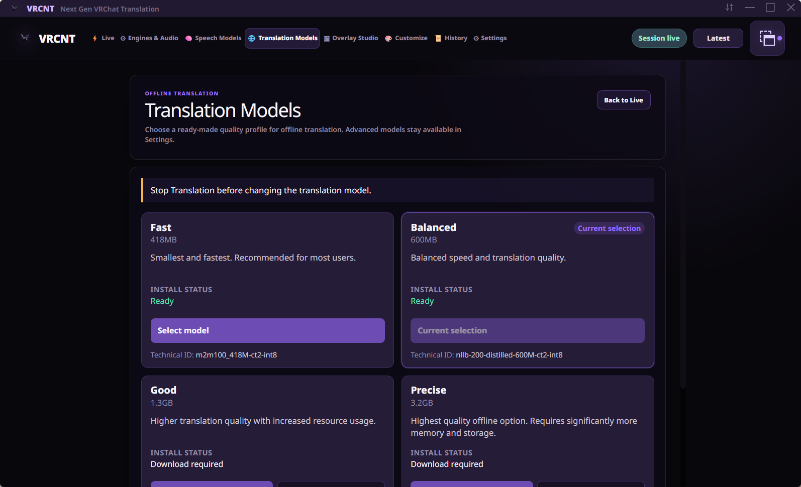
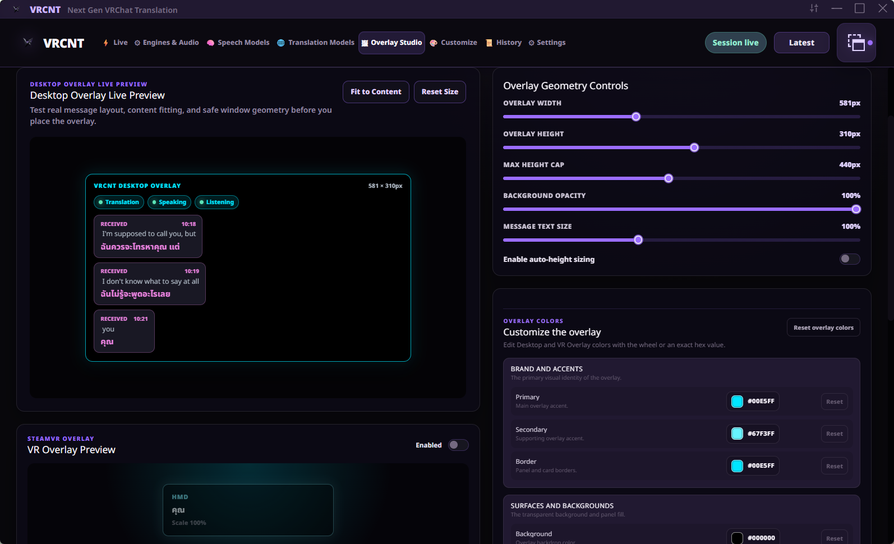
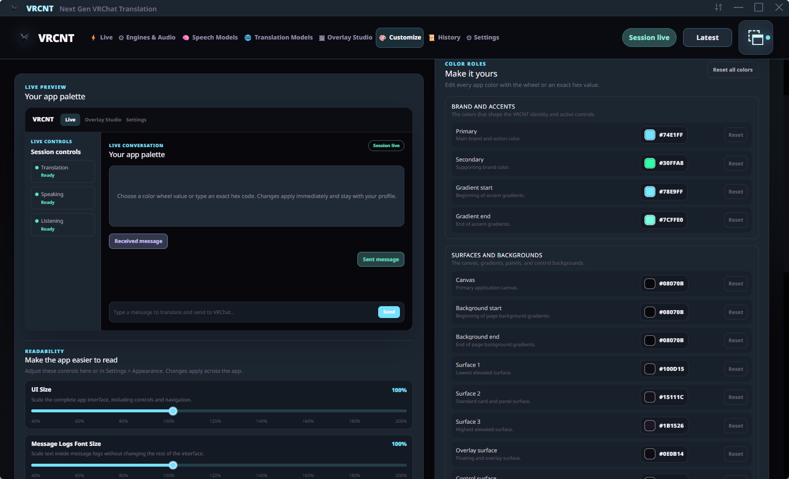

<p align="center">
  
</p>

<p align="center">
  <strong>专为 VRChat 打造的实时翻译与语音转文字工具</strong>
</p>

<p align="center">
  
  
  
</p>

<p align="center">
  <a data-virustotal-file="VRCNT.exe" href="https://www.virustotal.com/gui/file/a9a92e1cfafd06f202d05be6829d1c1bf0d1b654408b566b37e10de3e7853e3b">
    
  </a>
  <a data-virustotal-file="VRCNT-backend.exe" href="https://www.virustotal.com/gui/file/e1978879936ab3dbd9fc3c837be12bcb6c9ed58c42ee31c56ec2705fabbf56d4">
    
  </a>
</p>

<p align="center">
  <font size="4">
    🌐 <strong>Select Language / 选择语言</strong><br />
    <a href="Readme.en.md">English</a> |
    <a href="Readme.th.md">ภาษาไทย</a> |
    <a href="Readme.jp.md">日本語</a> |
    <font color="#FFFFFF"><strong>简体中文</strong></font> |
    <a href="Readme.tcn.md">繁體中文</a> |
    <a href="Readme.kr.md">한국어</a>
  </font>
</p>

> [!NOTE]
> **注意:** 本文档由 AI 翻译，部分词汇或表达可能不够准确。

## 关于 VRCNT

VRCNT 是一款非官方的 VRChat 翻译与语音转文字应用，基于开源项目 [VRCT](https://github.com/misyaguziya/VRCT) 开发。它专为对延迟敏感的对话场景设计：语音可被快速转换为易读的翻译，不会因云服务商的卡顿而影响整体对话流程。

## VRCNT 5.6.3 预览

<p align="center">
  <font size="4"><strong>实时</strong></font>
</p>

<p align="center">
  
</p>

<p align="center">
  <font size="4"><strong>引擎和音频</strong></font>
</p>

<p align="center">
  
</p>

<p align="center">
  <font size="4"><strong>语音模型</strong></font>
</p>

<p align="center">
  
</p>

<p align="center">
  <font size="4"><strong>翻译模型</strong></font>
</p>

<p align="center">
  
</p>

<p align="center">
  <font size="4"><strong>叠加层工作室</strong></font>
</p>

<p align="center">
  
</p>

<p align="center">
  <font size="4"><strong>自定义</strong></font>
</p>

<p align="center">
  
</p>

## 翻译质量与贡献

除英语外的其他语言翻译均为自动生成。我们计划在下一个版本中提高泰语翻译质量，非常欢迎大家为改进任何语言的翻译做出贡献。

## 功能亮点

- 麦克风与扬声器的实时语音转文字。
- 支持多个翻译服务商并具备自动故障转移（Automatic Failover）功能。
- 每句话享有 5 秒的共享云端翻译时间预算。
- 后台服务商冷却机制，不会阻塞实时对话。
- 当云端服务不可用时，可自动回退至本地 CTranslate2。
- 支持对被跳过或失败的单句进行手动重试（Manual Retry）。
- 支持输出至 VR 悬浮窗、桌面悬浮窗、剪贴板、OSC 及 VRChat 聊天框。
- 单一的 CUDA Windows 构建版本，同时支持切换至 CPU 处理。
- 专注于使用体验的哑光黑与紫罗兰配色桌面界面。

## 硬件与性能

VRCNT 可以在纯 CPU 系统上运行，但使用 NVIDIA GPU 能够获得最佳的实时性能。

VRCNT 包含了本地 AI 运行时依赖，因此应用安装包体积较大。这使用户能够在不依赖云端服务的情况下使用本地语音与翻译功能。

- 语音模型在安装后可能需要额外下载。
- 较大的模型需要消耗更多的内存（RAM）或显存（VRAM），请根据您的电脑配置选择合适的模型。
- 支持纯 CPU 模式，但在使用较大语音模型时延迟可能较高。
- 云端引擎可以减轻性能较低电脑的负担，但需要连接互联网。

## 构建 (Build)

安装依赖项目：

```powershell
npm ci
```

构建 CUDA Sidecar 及 Windows 应用：

```powershell
npm run build-cuda
```

生成的发布可执行文件及安装包位于
`src-tauri/target/release`。

官方构建版本发布于 [GitHub Releases](https://github.com/awakenginexe/VRCNT/releases)。
安装包可以自动下载其 3 个已签署的多分卷包文件，或者当
`VRCNT_<version>.7z.001` 至 `.003` 与 `package-manifest.json` 及 `package-manifest.json.sig`
放置在同一目录下时直接使用。如需便携运行 VRCNT，请保持这 3 个分卷包在同一目录下，使用 7-Zip 解压 `.7z.001`，并从解压后的目录中运行 `VRCNT.exe`。

下载的模型和配置文件保存在
`%LOCALAPPDATA%\VRCNTData`。如果新目录尚不存在，VRCNT 4.1.0 将自动迁移现有的 `VRCNT-NextData` 目录。

## 项目渊源

VRCNT 基于 misyaguziya 开发的 [VRCT](https://github.com/misyaguziya/VRCT)。
原项目与本衍生项目均基于 MIT 许可证分发。

若遇到 VRCNT 特有的问题，请通过
[VRCNT Issue Tracker](https://github.com/awakenginexe/VRCNT/issues)
反馈，而非上游的 VRCT 追踪器。

## 许可证与免责声明

请参阅 [LICENSE](../LICENSE) 与 [NOTICE.md](../NOTICE.md)。VRCNT 为非官方软件，未经 VRChat 官方认可或赞助。VRChat 及其相关资产均为 VRChat Inc. 的商标或注册商标。
