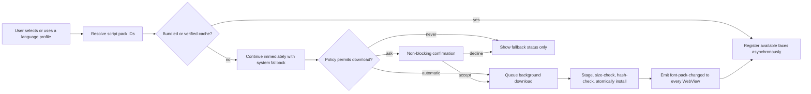

# Noto Script Font Packs — Audit and Architecture Design

**Status:** design-only; no implementation or font acquisition has occurred.  
**Audit date:** 2026-08-02  
**Repository baseline:** `main` at `d7e2210f8499bc0ac024fcd04531374e12ddee36`  
**Worktree:** `C:\Users\ANXE\Desktop\Coding\VRCNT-Next-Worktrees\feature-noto-script-font-packs`  
**Feature branch:** `feature/noto-script-font-packs`

This document is intentionally an architecture decision record, not an implementation plan that changes the product today. The audit did not start Vite, Tauri, Python, Cargo, a build, or an installer build. It did not retrieve any font binary. Upstream inspection was limited to source listings and text metadata.

## Design invariants

- VRCNT owns its font files; Windows font installation and administrator access are never required.
- A script pack is the unit of acquisition. A language selection can resolve to more than one pack, but no feature downloads one font per language.
- A missing, failed, stale, or corrupt font pack is always a rendering-quality condition, never a transcription, translation, OSC, overlay, startup, or language-selection failure.
- Bundled and downloaded faces are shared by the WebViews and the Pillow VR renderer whenever their respective runtimes can use the same TrueType file.
- The user’s existing selected system font is retained without rewriting it. It becomes a fallback after managed VRCNT Noto faces under the recommended policy.
- The authoritative pack manifest is shipped with the application release. The application never treats a remote, mutable manifest or a user-provided URL as authority.

## 1. Current architecture findings

### Application packaging and windows

- [`vite.config.js`](../../../vite.config.js) builds the React frontend into `dist`; [`src-tauri/tauri.conf.json`](../../../src-tauri/tauri.conf.json) packages that directory as `frontend` and packages `src-tauri/bin/_internal` as `_internal`.
- The Tauri identifier is `com.vrcnt.app`. Its current `app.security.csp` is `null`; no asset protocol scope is configured. The application uses the `main` window and creates a `desktop-overlay` Webview window.
- [`src-ui/views/app/index.jsx`](../../../src-ui/views/app/index.jsx) chooses `DesktopOverlayApp` for `index.html?window=desktop-overlay`; it is a second React root rather than a DOM child of the main application.
- [`src-ui/logics/common/desktopOverlayWindow.js`](../../../src-ui/logics/common/desktopOverlayWindow.js) creates the separate window and synchronizes its payload through `BroadcastChannel` and local storage. The payload contains UI-language and message data, but it does not carry the selected font-family preference today.
- The guided setup is a main-app surface, not a third Tauri window. Overlay Studio’s preview is likewise in the main WebView. OSC transmits text; it has no separate font-rendering surface.

### Current Rust/Tauri font and download interfaces

- [`src-tauri/src/lib.rs`](../../../src-tauri/src/lib.rs) registers `get_font_list()` and `download_zip_asset(url: String)`.
- `get_font_list()` uses `font_kit::source::SystemSource` and is the source for the current system-font selector.
- `download_zip_asset()` accepts an arbitrary URL, downloads it into memory, and returns a base64 ZIP payload. It has no fixed origin, expected size, digest validation, cache layout, atomic installation, or concurrent-download control. A source search found no caller. It is not suitable for font-pack acquisition and must not be reused for that purpose.
- [`src-tauri/capabilities/vrct_capability.json`](../../../src-tauri/capabilities/vrct_capability.json) currently grants filesystem defaults and scoped HTTP access to GitHub and the GitHub API for `main` and `desktop-overlay`. Frontend code also uses the HTTP plugin for existing GitHub requests in [`src-ui/logics/common/useFetch.js`](../../../src-ui/logics/common/useFetch.js), so this feature must not casually remove or broaden that existing permission.

### Existing reusable product infrastructure

- [`src-python/config.py`](../../../src-python/config.py) establishes the application data root as `_getUserDataPath("VRCNT")`: `%LOCALAPPDATA%\VRCNTData` when available, then `%APPDATA%\VRCNTData`, then `~/VRCNTData`. Frozen builds retain a legacy `VRCNT-NextData` directory only when its rename cannot yet complete.
- Existing model download paths already demonstrate progress UI, temporary files, and replacement patterns, but there is no shared production manager that provides a trusted manifest, hashes, pack locks, and cross-runtime activation. Font downloads should therefore be a dedicated Rust subsystem rather than an adaptation of a model downloader.
- [`src-ui/views/app/others/snackbar_controller`](../../../src-ui/views/app/others/snackbar_controller) supplies application notifications. The accessible confirmation-dialog structure in [`src-ui/views/app/config_page/setting_section/setting_box/_components/download_models/ModelDownloadConfirmation.jsx`](../../../src-ui/views/app/config_page/setting_section/setting_box/_components/download_models/ModelDownloadConfirmation.jsx) is an appropriate visual and interaction pattern to reuse without copying model-specific state.
- Release hosting and the Tauri updater already point at `https://github.com/awakenginexe/VRCNT/releases`. The current updater endpoint is `https://github.com/awakenginexe/VRCNT/releases/latest/download/latest.json`.

### Current VR font packaging

- [`spec/backend.spec`](../../../spec/backend.spec) copies `src-python/models/overlay/fonts` into the Python sidecar’s `_internal/fonts` directory.
- [`src-tauri/tauri.conf.json`](../../../src-tauri/tauri.conf.json) already packages that `_internal` directory with the desktop application. This is the strongest existing common resource path: the same bundled TTF can be read by Pillow and exposed to a WebView through Tauri’s narrowly scoped asset protocol. No duplicate Vite font copy is required.
- The current overlay asset folder contains `LeelawUI.ttf` (390,004 B), `NotoSansJP-Regular.ttf` (5,732,824 B), `NotoSansKR-Regular.ttf` (6,192,764 B), `NotoSansSC-Regular.ttf` (10,560,380 B), and `NotoSansTC-Regular.ttf` (7,110,560 B): 29,986,532 B (28.5974 MiB) in total.
- [`NOTICE.md`](../../../NOTICE.md) has no Noto attribution, and the current overlay font folder has no accompanying OFL text. That is a licensing gap the implementation must close when it replaces those assets.

## 2. Supported-language source of truth

The canonical source of selectable transcription languages is [`src-python/models/transcription/transcription_languages.py`](../../../src-python/models/transcription/transcription_languages.py), specifically its `transcription_lang` mapping. It defines display language, country/region, and engine codes for Google, Whisper, Parakeet, Vosk, and SenseVoice. The audited mapping currently contains 69 display-language keys and 135 language/country pairs. Every one of those pairs has Google and Whisper metadata; 68 pairs have Vosk support, 90 have Parakeet support, and 21 have SenseVoice support.

The visible list is intentionally narrower at runtime than that raw table:

- [`src-python/models/translation/translation_languages.py`](../../../src-python/models/translation/translation_languages.py) loads translation capability data from [`src-python/models/translation/translation_settings/languages/languages.yml`](../../../src-python/models/translation/translation_settings/languages/languages.yml).
- [`src-python/model.py`](../../../src-python/model.py) builds the selectable list as the appropriate transcription/translation intersection through `getListLanguageAndCountry`.
- [`src-ui/views/app/main_page/main_section/language_selector/LanguageSelector.jsx`](../../../src-ui/views/app/main_page/main_section/language_selector/LanguageSelector.jsx) additionally mirrors engine/model availability for Vosk, Parakeet, and SenseVoice. That UI filtering remains an engine decision; it must not become a second font registry.
- [`src-python/models/transcription/transcription_language_policy.py`](../../../src-python/models/transcription/transcription_language_policy.py) normalizes the three saved language slots per direction and applies per-engine active-slot limits. Whisper automatic detection chooses among configured language hints rather than serving as a global script guarantee. SenseVoice recognizes `auto`; Vosk and Parakeet have more limited language selection.
- Incoming, outgoing-translation, and target language profiles live in `Config.SELECTED_YOUR_LANGUAGES`, `Config.SELECTED_YOUR_TRANSLATION_LANGUAGES`, and `Config.SELECTED_TARGET_LANGUAGES`. The current HTTP routes are `/get/data/selectable_language_list`, `/get/data/font_family`, and `/set/data/font_family` in [`src-python/mainloop.py`](../../../src-python/mainloop.py).

The font system consumes a selected profile only after language selection has completed. It does not change the engine capability list, alter automatic language detection, or reject a valid existing profile because a font is unavailable.

## 3. Existing font and preference system

### Current CSS and overrides

- [`src-ui/views/app/_index_css/variables.css`](../../../src-ui/views/app/_index_css/variables.css) defines `--font_family` as `"Inter", "Segoe UI Variable Text", "Yu Gothic UI", system-ui, sans-serif`.
- [`src-ui/views/app/_index_css/root.css`](../../../src-ui/views/app/_index_css/root.css) applies that token at `html, body`; [`src-ui/views/app/_index_css/reset.css`](../../../src-ui/views/app/_index_css/reset.css) intentionally keeps `pre`, `code`, `kbd`, and `samp` on a monospace stack.
- [`src-ui/views/common_components/custom_select/CustomModernSelect.module.scss`](../../../src-ui/views/common_components/custom_select/CustomModernSelect.module.scss) hard-codes an Inter/system stack. [`src-ui/views/app/config_page/setting_section/setting_box/_components/_atoms/_entry/_Entry.module.scss`](../../../src-ui/views/app/config_page/setting_section/setting_box/_components/_atoms/_entry/_Entry.module.scss) hard-codes Arial. Both bypass the global token and must be made to inherit the managed stack.
- [`src-ui/views/app/others/snackbar_controller/ReactToastifyOverrideClass.scss`](../../../src-ui/views/app/others/snackbar_controller/ReactToastifyOverrideClass.scss) already defines `--toastify-font-family: var(--font_family)`, so notifications have a natural integration point. Conversation, setup, controls, and most overlay content otherwise inherit the root font.

### Current preference persistence and Thai special case

- [`src-ui/logics/configs/config_page_setter/ui_config_setter.js`](../../../src-ui/logics/configs/config_page_setter/ui_config_setter.js) defines the Appearance `SelectedFontFamily` setting, defaulting to `"Yu Gothic UI"`, using the `font_family` get/set endpoint.
- [`src-ui/views/app/_app_controllers/StartPythonController.jsx`](../../../src-ui/views/app/_app_controllers/StartPythonController.jsx) invokes Tauri `get_font_list` and stores system families in `Atom_SelectableFontFamilyList` in [`src-ui/logics/store.js`](../../../src-ui/logics/store.js).
- [`src-ui/views/app/_app_controllers/FontFamilyController.jsx`](../../../src-ui/views/app/_app_controllers/FontFamilyController.jsx) writes the saved setting directly into `--font_family`.
- [`src-ui/views/app/config_page/setting_section/setting_box/appearance/Appearance.jsx`](../../../src-ui/views/app/config_page/setting_section/setting_box/appearance/Appearance.jsx) uses [`src-ui/logics/common/thaiFontPreference.js`](../../../src-ui/logics/common/thaiFontPreference.js) to overwrite the user selection with installed `Itim` when the UI language changes to Thai, or warns that Itim is absent.

That automatic mutation conflicts with a VRCNT-managed Noto system. The implementation must remove the Thai-specific replacement behavior, retain a saved `Itim` value if a user already chose it, and make Noto Sans Thai available independently of the Windows font list.

## 4. Language-to-script mapping

### Canonical registry and resolution order

The implementation will ship one versioned declarative registry in the existing shared bundled-font resource directory: `src-python/models/overlay/fonts/font-packs.v1.json`. It is copied to `_internal/fonts` by the existing PyInstaller specification, read by the Rust font manager, returned to WebViews only through typed status/resolve commands, and read by the Python overlay resolver. `transcription_lang` remains the authoritative list of supported language/country pairs; a test rejects a registry that does not cover every current pair.

For a profile `{ language, country, engineCodes }`, the resolver:

1. trims text, Unicode-normalizes display labels to NFC, normalizes BCP-47 separators and case, and preserves the original profile for display;
2. obtains an explicit script subtag from an engine code when one exists (`Hans`, `Hant`, `Arab`, `Deva`, and so on);
3. applies exact language-and-region rules before language-only aliases;
4. emits an ordered, de-duplicated set of script-pack IDs, a BCP-47 `lang` value, and `ltr` or `rtl` direction metadata;
5. returns an empty managed-pack set for `auto`, malformed, or unknown input, leaving system fallback active; and
6. never asks a downloader to make the profile valid.

The priority is explicit script subtag, exact region, canonical language code, known display alias, then neutral fallback. A profile can yield multiple packs: Urdu yields `urdu` then `arabic`; Serbian and any Latin/Cyrillic variant yield the shared `latin-greek-cyrillic` pack; Japanese is one CJK pack that covers its mixed Han/Kana writing system.

### Current language groups and pack resolution

| Current display languages | Resolved script pack(s) | Notes |
| --- | --- | --- |
| Afrikaans, Albanian, Azerbaijani, Basque, Bosnian, Catalan, Croatian, Czech, Danish, Dutch, English, Estonian, Filipino, Finnish, French, Galician, German, Hungarian, Icelandic, Indonesian, Italian, Latvian, Lithuanian, Malay, Norwegian, Polish, Portuguese, Romanian, Slovak, Slovenian, Spanish, Sundanese, Swahili, Swedish, Turkish, Uzbek, Vietnamese | `latin-greek-cyrillic` | Latin Extended and Vietnamese are covered by Noto Sans. |
| Bulgarian, Kazakh, Macedonian, Mongolian, Russian, Serbian, Ukrainian | `latin-greek-cyrillic` | One core pack contains both Cyrillic and Latin fallbacks. |
| Greek | `latin-greek-cyrillic` | Greek and Greek Extended are in the core pack. |
| Thai | `thai` | Bundled. |
| Japanese | `japanese` | Bundled regional CJK face. |
| Chinese Simplified, including `cmn-Hans-HK` | `cjk-simplified` | `Hans` wins even when the country is Hong Kong. |
| Chinese Traditional, Taiwan | `cjk-traditional` | `Hant` + Taiwan maps to the Taiwan Traditional Chinese face. |
| Chinese Traditional, Hong Kong, including `yue-Hant-HK` | `cjk-hong-kong`, then `cjk-traditional` | The first pack is optional; the bundled TC face and then the system remain valid fallbacks. |
| Korean | `korean` | Bundled regional CJK face. |
| Lao | `lao` | Bundled under the recommendation. |
| Khmer | `khmer` | Bundled under the recommendation. |
| Burmese | `myanmar` | `Burmese` is an alias of Myanmar-script content. |
| Hindi, Nepali | `devanagari` | The registry also reserves Marathi for the same pack if source data later exposes it. |
| Arabic, Persian | `arabic` | Arabic-script profile; set `dir="rtl"` on message runs. |
| Urdu | `urdu`, `arabic` | Dedicated Nastaliq is first; Arabic is a safe second face. |
| Amharic | `ethiopic` | Optional. |
| Armenian | `armenian` | Optional. |
| Bengali | `bengali` | Optional. |
| Georgian | `georgian` | Optional. |
| Gujarati | `gujarati` | Optional. |
| Hebrew | `hebrew` | Optional and `rtl`. |
| Kannada | `kannada` | Optional. |
| Malayalam | `malayalam` | Optional. |
| Sinhala | `sinhala` | Optional. |
| Tamil | `tamil` | Optional. |
| Telugu | `telugu` | Optional. |
| Automatic, unknown, malformed, future unmapped languages | none | System and Pillow fallback remain active; no prompt blocks work. |

The registry has no one-language-one-file rule. It models script, region, aliases, direction, and ordered fallback. `lang` attributes are assigned to UI text and message runs, not inferred only from the application locale; this is essential for translated text whose language differs from the UI.

## 5. Proposed bundled packs

The recommendation is to bundle the six requested common packs plus Lao, Khmer, Myanmar, Devanagari, and Arabic. The five additional packs add only 2,813,060 B (2.6827 MiB) while directly covering current Southeast Asian, South Asian, and Arabic-script selections. The recommendation is deliberately not to add Hong Kong CJK or Color Emoji to the installer by default.

All source facts below come from the immutable Google Fonts source revision [`2796410152d4f9524b68ed46e69c1b60f8e0f7c3`](https://github.com/google/fonts/tree/2796410152d4f9524b68ed46e69c1b60f8e0f7c3/ofl/notosans). Every audited `METADATA.pb` specifies `license: "OFL"`; the source directories contain `OFL.txt`. The source revision is the font version identity available without downloading a binary. An approved asset-ingestion gate will record each OpenType name-table version alongside that immutable revision before publishing a VRCNT release manifest; a pack cannot be published without both values.

| Pack ID | Exact Google Fonts family and source file | Variable axes / available weights | Source format and WOFF2 status | Exact source bytes | Decision |
| --- | --- | --- | --- | ---: | --- |
| `latin-greek-cyrillic` | Noto Sans, `ofl/notosans/NotoSans[wdth,wght].ttf` | `wdth` 62.5–100; `wght` 100–900 | Variable TTF. The pinned source directory has no WOFF2 file. | 2,049,096 | Bundle |
| `thai` | Noto Sans Thai, `ofl/notosansthai/NotoSansThai[wdth,wght].ttf` | `wdth` 62.5–100; `wght` 100–900 | Variable TTF; no source WOFF2 file. | 218,652 | Bundle |
| `japanese` | Noto Sans JP, `ofl/notosansjp/NotoSansJP[wght].ttf` | `wght` 100–900 | Variable TTF; no source WOFF2 file. | 9,589,900 | Bundle |
| `cjk-simplified` | Noto Sans SC, `ofl/notosanssc/NotoSansSC[wght].ttf` | `wght` 100–900 | Variable TTF; no source WOFF2 file. | 17,772,300 | Bundle |
| `cjk-traditional` | Noto Sans TC, `ofl/notosanstc/NotoSansTC[wght].ttf` | `wght` 100–900 | Variable TTF; no source WOFF2 file. | 11,941,968 | Bundle |
| `korean` | Noto Sans KR, `ofl/notosanskr/NotoSansKR[wght].ttf` | `wght` 100–900 | Variable TTF; no source WOFF2 file. | 10,414,588 | Bundle |
| `lao` | Noto Sans Lao, `ofl/notosanslao/NotoSansLao[wdth,wght].ttf` | `wdth` 62.5–100; `wght` 100–900 | Variable TTF; no source WOFF2 file. | 176,620 | Bundle |
| `khmer` | Noto Sans Khmer, `ofl/notosanskhmer/NotoSansKhmer[wdth,wght].ttf` | `wdth` 62.5–100; `wght` 100–900 | Variable TTF; no source WOFF2 file. | 359,788 | Bundle |
| `myanmar` | Noto Sans Myanmar, `ofl/notosansmyanmar/NotoSansMyanmar[wdth,wght].ttf` | `wdth` 62.5–100; `wght` 100–900 | Variable TTF; no source WOFF2 file. | 784,832 | Bundle |
| `devanagari` | Noto Sans Devanagari, `ofl/notosansdevanagari/NotoSansDevanagari[wdth,wght].ttf` | `wdth` 62.5–100; `wght` 100–900 | Variable TTF; no source WOFF2 file. | 647,144 | Bundle |
| `arabic` | Noto Sans Arabic, `ofl/notosansarabic/NotoSansArabic[wdth,wght].ttf` | `wdth` 62.5–100; `wght` 100–900 | Variable TTF; no source WOFF2 file. | 844,676 | Bundle |

The selected normal variable TTF is the smallest auditable arrangement that serves all current 400, 500, 600, and 700 CSS requests using one source file per pack. A separate static Regular, Medium, SemiBold, and Bold arrangement would multiply assets, and the selected Google Fonts directories do not provide those static instances as the pinned source artifacts. Google’s CSS service can generate WOFF2 Unicode-range subsets, but those are not immutable project-controlled source artifacts, cannot serve Pillow, and are prohibited as runtime sources. A later, approved, deterministic conversion pipeline may introduce measured WOFF2 web derivatives only if it publishes new hashes, sizes, licenses, and separate Pillow TTF inputs; it is not part of this first implementation.

Regional CJK selection remains explicit. Noto’s own CJK repository distinguishes JP, KR, SC, TC, and HK regional variants, and documents the corresponding Google Fonts names [here](https://github.com/notofonts/noto-cjk). The CSS runtime must not register all CJK variants under an indistinguishable same-family/same-range face, because Han glyph choice is region-sensitive.

## 6. Proposed optional packs

These packs correspond to scripts in the current transcription source that are not part of the recommended bundle, plus optional regional/emoji coverage. Their direct source is the same pinned Google Fonts revision, each source metadata file reports OFL, and each source directory supplies TTF rather than WOFF2.

| Pack ID | Family and source file | Axes / usable weights | Exact bytes | Current language coverage | Recommendation |
| --- | --- | --- | ---: | --- | --- |
| `cjk-hong-kong` | Noto Sans HK, `ofl/notosanshk/NotoSansHK[wght].ttf` | `wght` 100–900 | 11,905,808 | Chinese Traditional, Hong Kong; Cantonese `yue-Hant-HK` | Optional; TC then system fallback if absent |
| `urdu` | Noto Nastaliq Urdu, `ofl/notonastaliqurdu/NotoNastaliqUrdu[wght].ttf` | `wght` 400–700 | 690,304 | Urdu | Optional, paired with `arabic` fallback |
| `ethiopic` | Noto Sans Ethiopic, `ofl/notosansethiopic/NotoSansEthiopic[wdth,wght].ttf` | `wdth` 62.5–100; `wght` 100–900 | 1,143,168 | Amharic | Optional |
| `armenian` | Noto Sans Armenian, `ofl/notosansarmenian/NotoSansArmenian[wdth,wght].ttf` | `wdth` 62.5–100; `wght` 100–900 | 221,936 | Armenian | Optional |
| `bengali` | Noto Sans Bengali, `ofl/notosansbengali/NotoSansBengali[wdth,wght].ttf` | `wdth` 62.5–100; `wght` 100–900 | 463,668 | Bengali | Optional |
| `georgian` | Noto Sans Georgian, `ofl/notosansgeorgian/NotoSansGeorgian[wdth,wght].ttf` | `wdth` 62.5–100; `wght` 100–900 | 231,988 | Georgian | Optional |
| `gujarati` | Noto Sans Gujarati, `ofl/notosansgujarati/NotoSansGujarati[wdth,wght].ttf` | `wdth` 62.5–100; `wght` 100–900 | 672,904 | Gujarati | Optional |
| `hebrew` | Noto Sans Hebrew, `ofl/notosanshebrew/NotoSansHebrew[wdth,wght].ttf` | `wdth` 62.5–100; `wght` 100–900 | 112,640 | Hebrew | Optional |
| `kannada` | Noto Sans Kannada, `ofl/notosanskannada/NotoSansKannada[wdth,wght].ttf` | `wdth` 62.5–100; `wght` 100–900 | 641,372 | Kannada | Optional |
| `malayalam` | Noto Sans Malayalam, `ofl/notosansmalayalam/NotoSansMalayalam[wdth,wght].ttf` | `wdth` 62.5–100; `wght` 100–900 | 504,204 | Malayalam | Optional |
| `sinhala` | Noto Sans Sinhala, `ofl/notosanssinhala/NotoSansSinhala[wdth,wght].ttf` | `wdth` 62.5–100; `wght` 100–900 | 1,181,956 | Sinhala | Optional |
| `tamil` | Noto Sans Tamil, `ofl/notosanstamil/NotoSansTamil[wdth,wght].ttf` | `wdth` 62.5–100; `wght` 100–900 | 340,668 | Tamil | Optional |
| `telugu` | Noto Sans Telugu, `ofl/notosanstelugu/NotoSansTelugu[wdth,wght].ttf` | `wdth` 62.5–100; `wght` 100–900 | 888,808 | Telugu | Optional |
| `emoji` | Noto Color Emoji, `ofl/notocoloremoji/NotoColorEmoji-Regular.ttf` | Regular only | 24,271,604 | Emoji, not language-specific | Optional opt-in; WebView compatibility must be tested and Pillow continues to use its normal/system fallback |

The optional set above totals 43,271,028 B (41.2665 MiB). It does not add speculative packs for source languages that VRCNT does not currently expose. If the source of truth later adds Punjabi, the registry requires a Gurmukhi pack decision before it can report managed coverage; the fallback remains neutral until then.

## 7. Measured font sizes

All figures are direct byte sizes of the named TTF source files at Google Fonts commit `2796410152d4f9524b68ed46e69c1b60f8e0f7c3`, measured from source metadata rather than estimated.

| Set | Bytes | MiB |
| --- | ---: | ---: |
| Six initially requested bundled packs | 51,986,504 | 49.5782 |
| Five recommended additional bundled packs | 2,813,060 | 2.6827 |
| Recommended 11-pack bundle | 54,799,564 | 52.2609 |
| Recommended bundle plus Hong Kong CJK | 66,705,372 | 63.6152 |
| Recommended bundle plus Color Emoji | 79,071,168 | 75.4081 |
| Existing overlay-font resource folder | 29,986,532 | 28.5974 |

## 8. Installer-size impact

The implementation should replace, not duplicate, the existing `src-python/models/overlay/fonts` payload. With that one shared-resource design:

- The measured uncompressed resource payload after the recommended bundle is **54,799,564 B (52.2609 MiB)**.
- The measured uncompressed resource delta against the currently packaged overlay font folder is **+24,813,032 B (23.6635 MiB)**.
- The final compressed NSIS installer delta is intentionally not claimed: measuring it would require the installer build expressly prohibited during this phase. Compression ratio, executable/resource layout, and deduplication are build outputs, not safe estimates.
- Optional downloads do not increase the installer; they consume the user’s font cache only after an explicit or policy-approved request.

## 9. Font manifest schema

`font-packs.v1.json` is a bundled, versioned, declarative authority. It names bundled and optional files, language/script rules, source provenance, and every immutable release artifact. It contains no user-entered URL and no executable payload.

The implementation schema has these enforced values:

```text
FontPackManifest
  schemaVersion: integer, exactly 1
  manifestVersion: release-compatible semantic identifier
  fontFamilyVersion: immutable VRCNT font-family release identifier
  sourceRevision: exactly 2796410152d4f9524b68ed46e69c1b60f8e0f7c3 for the first release
  packs: map keyed by an allow-listed pack ID

FontPack
  bundled: boolean
  displayName: non-empty localized-key or non-empty display string
  scripts: one or more ISO 15924 script identifiers
  profiles: language, alias, region, script, direction, and ordered-fallback rules
  family: internal VRCNT family name
  sourceFamily: exact upstream family name
  packVersion: immutable release identifier
  files: one or more FontPackFile values

FontPackFile
  role: web-and-pillow, font, or license
  relativePath: normalized basename ending in .ttf, or OFL.txt
  format: ttf or text
  weightRange: declared inclusive numeric range when the file is a font
  sourceRevision: immutable upstream revision
  sourceUrl: HTTPS Google Fonts provenance URL
  releaseUrl: HTTPS VRCNT GitHub Release asset URL when optional
  expectedBytes: positive exact integer
  sha256: exactly 64 lowercase hexadecimal characters
  licenseSpdx: exactly OFL-1.1
  copyrightNotice: non-empty preserved notice text
```

The Rust parser rejects an unsupported schema, unknown pack ID, duplicate path, empty field, non-HTTPS URL, non-VRCNT release URL, unsupported extension, non-basename path, invalid SHA-256 syntax, missing OFL file, invalid byte count, mismatched source revision, and manifest entries that are not known to the embedded pack-ID allow list. All files, including license text, receive an exact digest and byte count in the published manifest. This audit deliberately does not mint hashes for files it was not permitted to acquire; the release gate computes them from the approved source bytes before any manifest is committed or published.

## 10. Trusted hosting strategy

### Acquisition provenance

After approval, asset acquisition is a controlled release step from the pinned Google Fonts commit above. It obtains the exact source TTF and `OFL.txt`, verifies the source revision, extracts the OpenType version field, calculates SHA-256 and byte size, and stores those facts in the VRCNT manifest and notice material. The Google Fonts CSS API and `fonts.gstatic.com` are never runtime sources.

### Runtime source

Optional assets are published as individual, immutable files in a versioned VRCNT GitHub Release, such as the fixed release prefix:

```text
https://github.com/awakenginexe/VRCNT/releases/download/font-packs-v1/
```

Rust validates the initial URL against that exact HTTPS host, owner/repository, release-prefix, pack ID, version, and filename from the bundled manifest. Redirects are disabled unless each redirect target is a hard-coded GitHub release-asset host (`github.com`, `release-assets.githubusercontent.com`, or `objects.githubusercontent.com`) over HTTPS; credentials are never attached. The frontend does not invoke the HTTP plugin to download a font and does not receive arbitrary URLs.

The manifest ships with the application, so an app update changes the set of permissible pack versions. On startup/status refresh, an installed optional pack whose `packVersion` differs from the bundled manifest is `updateAvailable`; its current verified version remains usable until the replacement completes. This is simpler and safer than a remote manifest, keeps trust anchored in the existing signed application-update process, and avoids a separate mutable configuration channel.

## 11. Cache layout

The cache root is derived from the same application-data convention as `Config.PATH_DATA`, not from Tauri’s `com.vrcnt.app` WebView storage:

```text
<Config.PATH_DATA>/fonts/
  font-settings.v1.json
  manifest-state.v1.json
  .locks/
    <pack-id>.lock
  .staging/
    <random-install-id>/
  packs/
    <pack-id>/
      <pack-version>/
        <font-file>.ttf
        OFL.txt
        installed.v1.json
```

Rust resolves the base path lazily on each font-manager operation using the audited VRCNT convention: prefer the current `VRCNTData` root; if it is absent and the legacy `VRCNT-NextData` root remains, use the legacy root until Python’s existing migration establishes the current directory. It never moves either directory and never accepts a path from the WebView. This prevents a separate font migration from racing or overriding [`Config.init_config`](../../../src-python/config.py).

`installed.v1.json` is written last and records the manifest version, pack version, file names, exact byte counts, hashes, installation time, and license metadata. A directory lacking that marker is staging data and is never activated. The manager creates only user-profile directories with inherited user ACLs, uses no Windows Fonts location, keeps pack/version directories separate, and computes cache usage from verified installed entries only. Bundled resources remain outside this cache and cannot be removed from it.

## 12. Download and verification flow

Rust/Tauri owns acquisition, storage, verification, cache status, removal, and activation events. Python only consumes a verified cache; JavaScript owns presentation and user consent. This matches the trust boundary and leaves STT/translation code independent of rendering downloads.



For each requested optional pack, the manager:

1. resolves only a pack ID already present in the bundled manifest;
2. coalesces duplicate requests behind an in-process job and an exclusive `<pack-id>.lock` file, with other callers observing progress rather than creating a second download;
3. streams each allowed `.ttf` and `OFL.txt` into a unique same-volume staging directory, enforcing a hard expected-byte limit while writing;
4. compares `Content-Length` with the manifest when supplied, requires the final byte count in all cases, and verifies SHA-256 before any final path is visible;
5. rejects an unexpected redirect, content type that is not a font/text asset, unexpected file name, symlink, directory, archive, or executable extension;
6. writes and synchronizes the installation marker only after every manifest file verifies, then atomically renames the staged version directory into `packs`;
7. removes failed staging data and releases the lock on every error; startup cleans abandoned staging directories; and
8. emits progress and a final `font-pack-changed` event only after successful activation.

Cache status performs fast marker/path/size checks, and performs a digest validation before activating a requested cache entry or after detecting an inconsistency. A failed revalidation removes only that bad version and falls back immediately. Retry is explicit from the UI and obeys the same manifest and lock rules.

Language persistence and STT startup happen before any prompt or job is scheduled. No caller awaits a font transfer as a condition of selecting a language, starting an engine, emitting OSC, starting the application, or generating an overlay frame.

## 13. Runtime font registration

### Logical families and fallback order

The product-facing system is named **VRCNT Noto**. Internally it uses a generic family plus regional CJK family aliases so that identical Han Unicode ranges do not accidentally choose the wrong regional glyph form:

```css
--vrcnt-user-font: "Yu Gothic UI";
--vrcnt-system-fallback: "Segoe UI Variable Text", "Yu Gothic UI", system-ui, sans-serif;
--vrcnt-script-stack: "VRCNT Noto Core";
--font_family: var(--vrcnt-script-stack), var(--vrcnt-user-font), var(--vrcnt-system-fallback);
```

`VRCNT Noto Core` registers Noto Sans, Thai, Lao, Khmer, Myanmar, Devanagari, Arabic, and installed optional non-CJK faces with correctly scoped `unicodeRange` descriptors. CJK faces receive region-specific names such as `VRCNT Noto Japanese`, `VRCNT Noto SC`, `VRCNT Noto TC`, `VRCNT Noto HK`, and `VRCNT Noto KR`. CSS rules select a CJK stack by an element’s BCP-47 `lang` value or a resolver-produced `data-vrcnt-script` value. This preserves Japanese, Simplified Chinese, Traditional Chinese, Hong Kong Chinese, and Korean typography even when their Han code points overlap.

The recommended precedence is managed VRCNT Noto first, the saved system font second, then system UI/sans serif. That makes quality and glyph coverage deterministic for supported scripts while preserving every existing custom selection as a fallback rather than silently deleting or overwriting it. Monospace elements remain on the intentional monospace stack.

### WebView loader

Rust exposes only typed status and verified resource/cache paths. The frontend converts those paths with Tauri’s `convertFileSrc`, then creates `FontFace` objects with `font-weight` ranges and `unicodeRange` descriptors, awaits `load()`, and adds them to `document.fonts`. On a loading error it removes the incomplete face and leaves the normal CSS fallback stack untouched.

Tauri’s asset protocol is the appropriate bridge for locally verified cache files, provided it is enabled with a narrow scope. The implementation adds only:

```text
$RESOURCE/_internal/fonts/**/*
$LOCALDATA/VRCNTData/fonts/**/*
$LOCALDATA/VRCNT-NextData/fonts/**/*
$APPDATA/VRCNTData/fonts/**/*
$APPDATA/VRCNT-NextData/fonts/**/*
$HOME/VRCNTData/fonts/**/*
$HOME/VRCNT-NextData/fonts/**/*
```

Tauri documents that `convertFileSrc` loads are controlled by `app.security.assetProtocol` and reject paths outside its scope [here](https://v2.tauri.app/security/asset-protocol/). The feature does not expose an arbitrary user path. The current permissive `csp: null` is not broadened by this work; if the project elects to tighten CSP separately, its tested policy must include the asset-protocol font source (`font-src 'self' asset:` or Tauri’s platform-equivalent asset origin).

All existing and newly installed faces rehydrate during each WebView’s initialization. The manager event makes a successfully downloaded pack usable without an application restart. The runtime disposer removes its registered faces on development hot replacement, so future HMR does not accumulate duplicate `FontFace` entries.

## 14. Main UI integration

The main `App` mounts the new `FontPackController` beside `UiLanguageController` and `FontFamilyController` in [`src-ui/views/app/App.jsx`](../../../src-ui/views/app/App.jsx). It obtains status from Rust, initializes bundled/cache faces, listens for manager events, and exposes a resolved profile to the main message and settings surfaces.

Implementation responsibilities:

- Refactor `FontFamilyController` to set `--vrcnt-user-font`, not to replace `--font_family`.
- Update `UiLanguageController` to maintain `document.documentElement.lang`; translated/transcribed message runs receive the actual profile language and `dir` rather than inheriting only the UI locale.
- Add the font-stack rules to the global CSS entry and remove component-specific hard-coded font declarations from custom select and settings entries.
- Keep buttons, inputs, textareas, native selects, custom dropdowns, message bubbles, setup pages, Overlay Studio preview, and Toastify notifications on the same inherited variable.
- Replace the Thai `Itim` auto-selection/warning path with the bundled Thai status. The saved system selection remains unchanged.
- Treat OSC as text transport. Its preview inherits the main UI stack; transmitting OSC never waits for a pack.

## 15. Desktop Overlay integration

[`src-ui/views/app/desktop_overlay/DesktopOverlayApp.jsx`](../../../src-ui/views/app/desktop_overlay/DesktopOverlayApp.jsx) currently mounts no `FontFamilyController` or Python startup controller. It must therefore initialize the shared `FontPackRuntime` directly, resolve asset/cache faces independently, listen for `font-pack-changed`, and set its root `lang` from the synchronized payload.

[`src-ui/logics/common/desktopOverlayWindow.js`](../../../src-ui/logics/common/desktopOverlayWindow.js) and its tests gain the selected user fallback family and relevant script-profile metadata in the overlay payload. The existing `BroadcastChannel`/local-storage fallback carries that state into an already-open overlay. Font-pack installation still uses the Rust event in each WebView; message arrival and UI-language synchronization remain independent.

The outcome is that the overlay re-renders with a newly installed WebView font as soon as that face loads, with no application restart and no dependency on the main window remaining open.

## 16. VR Overlay integration

[`src-python/models/overlay/overlay_image.py`](../../../src-python/models/overlay/overlay_image.py) currently maps only Default/Japanese/Korean/Chinese Simplified/Chinese Traditional/Thai to a small collection of bundled files and then searches `%WINDIR%\Fonts`. It loads a single Pillow font per rendering call. This does not cover the full supported language set and can fail when its default file is absent.

The implementation adds `OverlayFontPackResolver` in `src-python/models/overlay/font_packs.py`. It reads the shared bundled manifest from `_internal/fonts`, validates cache paths against `<Config.PATH_DATA>/fonts/packs`, accepts a downloaded font only when its `installed.v1.json` matches a known manifest entry, and resolves in this order:

1. verified current cache pack;
2. matching bundled pack in `_internal/fonts`;
3. an explicitly allowed system-font fallback;
4. `ImageFont.load_default()` as a final non-throwing renderer fallback.

The renderer changes from a one-language/one-font lookup to script-aware text runs. It keeps combining marks with their base cluster, chooses CJK variants from the resolved profile, uses the generic core for shared punctuation/Latin/Cyrillic/Greek runs, and lays out mixed-script runs with their selected face. It applies `rtl` direction and Pillow’s complex-text layout support where present, with visual tests for Arabic and Indic shaping. A missing pack selects the next fallback for that run and does not abort image construction.

The chosen variable TTFs are also usable by Pillow at their default Regular instance, which matches the current overlay’s regular-only typography. The current overlay does not request a distinct bold style. The resolver clears or version-keys its in-memory face cache when the installed-marker version changes, so the next generated frame can use a newly installed pack without restarting VRCNT. It does not download anything, start a WebView, or install fonts into Windows.

## 17. User settings and prompts

Add a compact **Font packs** section to Appearance, not a settings redesign. It has:

- Download policy: **Ask before downloading** (default), **Automatically download required packs**, or **Never download; use system fallback**.
- A non-blocking confirmation for an uninstalled required pack: pack name, writing system, exact manifest size, OFL license, and a clear statement that VRCNT continues using fallback if declined.
- Progress, retry, cancellation-before-commit, failure explanation, and an accessible completion notification.
- Installed optional packs: version, verified size, source/license link, last verified status, remove action, and total cache size.
- Bundled packs shown as included and non-removable.
- A visible system-fallback state for a selected script whose optional pack is missing.

New policy and UI status are stored by the Rust font manager in `font-settings.v1.json` and `manifest-state.v1.json`, not in a browser-only store. The existing `SelectedFontFamily` continues to use the existing Python configuration route and remains backward compatible. A `never` policy neither prompts nor queues work. An `automatic` policy schedules a background job only after language selection is complete; it never changes the language-selection result.

## 18. Offline and failure behavior

Offline startup loads bundled faces and any verified cache without a network request. A missing optional face leaves the user-selected system font and final system stack available. An unavailable server, rejected redirect, bad content length, SHA mismatch, disk-full failure, interrupted process, lock conflict, or corrupt cache produces a recoverable pack status and notification, cleans incomplete staging data, and leaves all speech, translation, OSC, Desktop Overlay, and VR Overlay paths operational.

The manager does not run a mandatory update check at startup. It reports a version difference after an app update through normal status inspection, retains a good older cache until the user or policy replaces it, and never removes a working pack before its replacement verifies. Removing an optional pack unloads its WebView face on the next runtime refresh and makes the next VR frame choose fallback; it does not delete a bundled asset or a user-selected Windows font.

## 19. Security and privacy

- **Trust boundary:** Rust accepts only embedded-manifest pack IDs and fixed VRCNT GitHub Release assets over HTTPS. It does not accept a URL, filename, path, hash, or expected size from JavaScript.
- **Integrity:** both expected byte count and SHA-256 are mandatory before activation. Hashes cover font and license files. Cache entries are revalidated on activation when necessary.
- **Filesystem safety:** only normalized `.ttf` and `OFL.txt` basenames are permitted; no archives, symlinks, traversal segments, executables, arbitrary resource reads, or Windows Fonts writes are involved. Staging directories are same-volume, atomic replacement is used, and locks serialize a pack installation.
- **WebView exposure:** the asset protocol exposes only bundled `_internal/fonts` and the exact VRCNT font-cache roots. Local cache files outside those scopes remain inaccessible to `convertFileSrc`.
- **Privacy:** a request identifies an optional generic pack such as `bengali` or `cjk-hong-kong`, not an entered transcript or a language-profile query string. The VRCNT GitHub release host can observe that generic asset request and ordinary network metadata. `Ask` and `Never` allow users to avoid that request. No telemetry is added by this feature.
- **Availability:** digest failures, unavailable hosting, and downloader bugs remain isolated to the font manager; no engine or language settings depend on them.

## 20. Licensing

Every proposed source family was individually checked through its Google Fonts `METADATA.pb`; all report `OFL`, which maps to SPDX `OFL-1.1`. The bundle/download release gate preserves the exact upstream `OFL.txt`, all copyright text, source family, source directory, immutable source revision, OpenType version, VRCNT pack version, byte size, and digest.

Implementation licensing work is concrete:

- Place an upstream `OFL.txt` next to every bundled family asset in `src-python/models/overlay/fonts`; do the same in every verified optional cache version.
- Add a Noto section to [`NOTICE.md`](../../../NOTICE.md) identifying each family, `OFL-1.1`, the Google Fonts source revision, and the VRCNT font-pack release version.
- Add a compact Font licenses entry to the existing About surface in [`src-ui/views/app/config_page/setting_section/setting_box/about_vrct/AboutVrct.jsx`](../../../src-ui/views/app/config_page/setting_section/setting_box/about_vrct/AboutVrct.jsx), backed by the bundled/installed manifest metadata so it works offline.
- Correct the existing un-attributed Noto overlay files as part of their replacement; no old Noto file remains packaged without its license material.

## 21. Approved implementation update — direct official optional sources

The initial runtime-hosting proposal assumed a VRCNT-owned immutable GitHub Release. That release is not a prerequisite for this feature. Optional packs instead use their exact, immutable official upstream binary URL from the bundled manifest: an official `google/fonts` repository file at the pinned source revision, an official `notofonts` repository/release asset, or an official fixed Google-hosted binary only when the repository/release form is unavailable. A manifest entry records the repository, exact revision or release, upstream path, family/version/style, byte size, SHA-256, and OFL source before the pack can be offered for download. It never accepts a URL from the WebView and never uses a mutable branch, the Google Fonts CSS API, or a runtime CSS import.

Optional files are downloaded once by the Rust manager into the verified VRCNT cache and are subsequently loaded locally. The generic pack URL discloses only a pack identifier to the upstream host; it carries no transcript, profile, or user-provided query. A failure remains a non-blocking system-fallback condition.

The user-facing default choice is **VRCNT Noto (Recommended)** with logical CSS family `"VRCNT Noto"`. It selects managed script faces automatically and is the default for new, missing, and invalid preferences. An existing valid explicit user font remains intact and is used as the managed stack's fallback; migration never overwrites that preference. Internal Noto script families remain implementation details rather than normal selectable font-family entries.

This design uses upstream source provenance from Google Fonts and VRCNT-controlled release distribution. It does not infer a license from a family name or use an uncontrolled CDN.

## 21. Configuration migration

There is no destructive migration of `SelectedFontFamily`. Existing values, including `Itim` and fonts no longer installed, remain in the Python config file and are set as `--vrcnt-user-font`. A nonexistent system font is naturally skipped by CSS, leaving VRCNT Noto and system fallbacks usable.

The first font-manager launch creates a versioned `font-settings.v1.json` with policy `ask`; it does not modify `config.json`. The Thai UI-language handler stops overwriting the saved setting. Legacy data-root behavior remains owned by [`Config.init_config`](../../../src-python/config.py); Rust’s lazy resolver uses the current root when present and the legacy root only while it remains the active location. Cache state is self-describing by schema and manifest version, so unsupported state is ignored/rebuilt rather than coerced.

Desktop-overlay local storage gains optional font-family/profile fields with a schema-compatible default. Existing payloads without those fields continue to render using the global default/system fallback until the main window publishes a newer payload.

## 22. Testing strategy

Use the existing frameworks only: Node’s built-in test runner through `npm run test:ui`, Python’s existing `unittest` layout under `src-python/tests`, and Rust unit/integration tests through the existing Cargo test setup. No new test framework is necessary.

| Area | Required coverage |
| --- | --- |
| Registry | Every `transcription_lang` language/country pair is covered; aliases, capitalization, NFC input, BCP-47 script subtags, region variants, unknown input, `auto`, multi-pack Urdu, and shared-script languages resolve deterministically. |
| UI profiles | Current incoming/outgoing/target three-slot profiles preserve selection while a pack is missing; engine restrictions remain unchanged. |
| Manifest | Schema version rejection, unknown pack rejection, bad source revision, invalid host, HTTP URL, malformed hash, unsupported extension, traversal, duplicate path, missing license, and mismatched byte limit. |
| Downloader | Good download, absent `Content-Length`, mismatched `Content-Length`, byte-size mismatch, SHA mismatch, interruption, stale staging cleanup, atomic install, duplicate concurrent request coalescing, retry, cache corruption, removal, and update-available state. |
| Runtime WebViews | Bundled registration, cache registration, activation event, rehydration after reload, disposal on HMR, missing-pack fallback, CJK `lang` stack selection, user-font preservation, controls/custom dropdown/Toastify inheritance, and offline startup. |
| Desktop Overlay | Separate-root initialization, payload migration, live install event, message language metadata, fallback with main window closed, and unchanged overlay controls. |
| VR Overlay | Manifest/cache path confinement, bundled/cache/system/default ordering, cache-version invalidation, mixed-script runs, Arabic/Indic shaping visual cases, CJK regional cases, unknown fallback, and no image-rendering exception after a missing/corrupt optional pack. |
| Licensing/release | Every released font entry has a matching OFL file, source revision, OpenType version record, byte size, and SHA-256; `NOTICE.md` lists the shipped set. |

Manual release verification renders representative text for every bundled and optional script in the Main UI, Desktop Overlay, and VR Overlay. It includes CJK regional comparison strings, Arabic/Hebrew direction, combining marks, Thai/Lao/Khmer/Myanmar/Indic shaping, a user-selected custom fallback, offline first launch, a declined prompt, a corrupt cache, and a hot-installed optional pack. No automated test in this design phase is run because no feature code or assets have been added.

## 23. Exact proposed files to create or modify

### Create during approved implementation

- `src-tauri/src/font_packs.rs` — manifest parser, safe Rust manager, cache state, commands, events, verification, locks, and tests.
- `src-python/models/overlay/font_packs.py` — shared-manifest/cache resolver and script-run support for Pillow.
- `src-python/models/overlay/fonts/font-packs.v1.json` — bundled manifest and language/script registry.
- `src-ui/logics/common/fontPackRuntime.js` — typed command bridge, `FontFace` registration, rehydration, event listener, and disposer.
- `src-ui/views/app/_app_controllers/FontPackController.jsx` — main WebView runtime mount.
- `src-ui/views/app/_index_css/fontPacks.css` — managed-stack and language/script rules.
- `src-ui/views/app/config_page/setting_section/setting_box/appearance/FontPacks.jsx` — compact policy/status manager.
- `src-ui/views/app/config_page/setting_section/setting_box/appearance/FontPacks.module.scss` — font-pack section styles.
- `src-ui/views/app/config_page/setting_section/setting_box/appearance/FontPackDownloadConfirmation.jsx` — accessible confirmation dialog.
- `src-ui/logics/common/__tests__/fontPackRuntime.test.js` — frontend resolver/runtime behavior.
- `src-python/tests/test_font_packs.py` — Python resolver, fallback, and overlay tests.

### Modify during approved implementation

- `src-tauri/src/lib.rs` — register the scoped font-manager module and commands; retire the unused arbitrary `download_zip_asset` command only after its no-call-site status is reverified.
- `src-tauri/Cargo.toml` and `src-tauri/Cargo.lock` — add a Rust SHA-256 implementation required for local verification.
- `src-tauri/tauri.conf.json` — enable and narrowly scope the asset protocol; retain existing packaged `_internal` resources.
- `src-tauri/capabilities/vrct_capability.json` — keep permissions least-privilege after adding only any demonstrably required resource access.
- `src-ui/views/app/App.jsx` and `src-ui/views/app/_app_controllers/index.js` — mount/export `FontPackController`.
- `src-ui/views/app/desktop_overlay/DesktopOverlayApp.jsx` — initialize the runtime in the separate WebView and apply language metadata.
- `src-ui/logics/common/desktopOverlayWindow.js` and `src-ui/logics/common/__tests__/desktopOverlayWindow.test.js` — carry/migrate font fallback and profile data.
- `src-ui/views/app/_app_controllers/FontFamilyController.jsx` — preserve the saved value as `--vrcnt-user-font`.
- `src-ui/views/app/_app_controllers/UiLanguageController.jsx` — apply root `lang` and coordinate profile metadata.
- `src-ui/views/app/_index_css/root.css` and `src-ui/views/app/_index_css/variables.css` — import and define managed fallback tokens.
- `src-ui/views/common_components/custom_select/CustomModernSelect.module.scss` — remove the bypassing Inter stack.
- `src-ui/views/app/config_page/setting_section/setting_box/_components/_atoms/_entry/_Entry.module.scss` — remove the bypassing Arial stack.
- `src-ui/views/app/config_page/setting_section/setting_box/appearance/Appearance.jsx` and `src-ui/logics/common/thaiFontPreference.js` — remove Thai-specific system-font mutation and mount Font packs.
- `src-ui/views/app/others/snackbar_controller/ReactToastifyOverrideClass.scss` — verify/apply inherited managed stack.
- `src-ui/views/app/main_page/main_section/message_container/log_box/message_container/MessageContainer.jsx`, `src-ui/views/app/main_page/main_section/message_container/log_box/message_container/MessageText.jsx`, and `src-ui/views/app/main_page/main_section/message_container/log_box/message_container/translation_entry/TranslationEntry.jsx` — attach source/translation `lang`, `dir`, and script metadata to rendered message runs.
- `src-python/models/overlay/overlay_image.py` — replace fixed language filenames with the shared resolver and safe mixed-script fallback.
- `src-python/models/overlay/fonts/` — replace current un-attributed overlay fonts with the approved bundled manifest, exact TTF assets, and OFL files; this directory is already included by `spec/backend.spec` and Tauri `_internal` packaging.
- `NOTICE.md` and `src-ui/views/app/config_page/setting_section/setting_box/about_vrct/AboutVrct.jsx` — Noto attribution and offline license display.
- `locales/en.yml`, `locales/ja.yml`, `locales/ko.yml`, `locales/th.yml`, `locales/zh-Hans.yml`, and `locales/zh-Hant.yml` — complete localized Font packs copy.

Language metadata belongs on the smallest text-bearing source/translation run, not merely on the application root.

## 24. Implementation milestones

1. **Lock data contracts.** Add the manifest schema/registry, Rust parser tests, language-coverage validation, and release-ingestion validation before adding any font binary.
2. **Build the trusted manager.** Add cache state, fixed release-source validation, streaming digest/size verification, atomic install, lock handling, status/remove/update commands, and Rust tests with temporary data only.
3. **Add approved bundled assets and licenses.** Acquire only the approved pack set from the pinned source, record hashes/OpenType versions, install exact OFL files, update notice data, and verify no duplicate old overlay assets remain.
4. **Integrate WebViews.** Enable scoped asset access, add the shared runtime, managed CSS stack, status/policy UI, payload migration, and Main UI/Desktop Overlay tests.
5. **Integrate Pillow.** Add shared cache/bundle resolution, mixed-script runs, fallback behavior, cache-version invalidation, complex-script render tests, and VR verification.
6. **Verify release behavior.** Run the existing relevant test suites, asset/notice manifest checks, offline/corruption/concurrency scenarios, visual matrices, and a measured installer build only after the user authorizes build work.

Each milestone is independently reviewable. A later milestone does not substitute for the integrity tests or licensing checks in an earlier one.

## 25. Open decisions requiring user approval

1. **Bundled coverage:** approve the recommended 11-pack bundle (52.2609 MiB uncompressed resource payload) rather than only the six initially named packs (49.5782 MiB). The added Lao, Khmer, Myanmar, Devanagari, and Arabic coverage costs 2.6827 MiB.
2. **Hong Kong CJK:** keep Noto Sans HK optional at 11.3543 MiB, with Noto Sans TC/system fallback, or bundle it for immediate `yue-Hant-HK` fidelity.
3. **Color Emoji:** keep its 23.1472 MiB Regular TTF optional, limited to platforms that pass WebView compatibility testing, rather than expanding every installer for non-language-specific glyphs.
4. **Asset format:** approve one variable TTF per pack for shared WebView/Pillow use. It is the only measured, pinned common artifact in this audit; WOFF2/static derivatives would require a separately approved, reproducible, measured release pipeline.
5. **Font precedence:** approve managed VRCNT Noto before the saved user system font, preserving the saved font as fallback. The opposite precedence gives the user font first choice but can defeat deterministic script coverage.
6. **Manifest authority:** approve a bundled, versioned manifest updated with normal VRCNT releases rather than a separately fetched remote manifest.
7. **Default policy:** approve **Ask before downloading** as the initial setting; it is privacy-preserving and never blocks a valid language selection.

No code, dependencies, manifest changes, font binaries, builds, commits, pushes, merges, rebases, or worktree cleanup are authorized by this design document. Implementation begins only after explicit approval.
